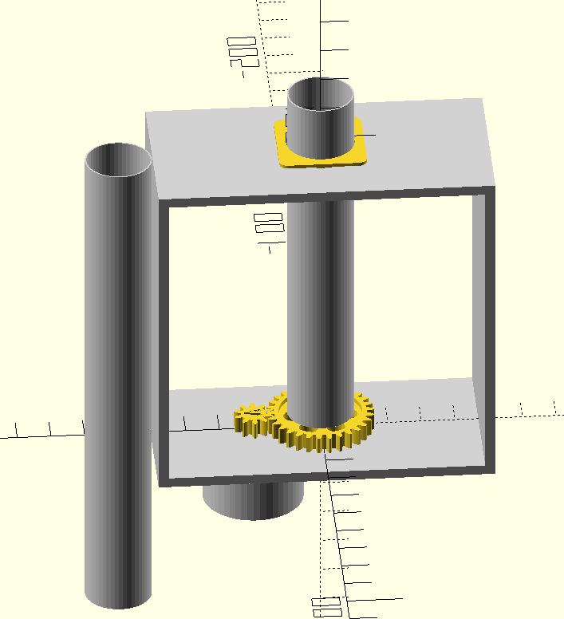
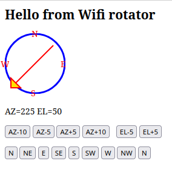

# Wifi rotator

## Rotator for light weight antennas azimuth and elevation

The Antenna rotator can be controlled via WEB interface (port 80) or hamlib NET rotctl (TCP port 4533).
- Access the web interface with /rotator?AZ=180&EL=20
- You can use Gpredict to control via hamlib NET rotctl.

  
  

